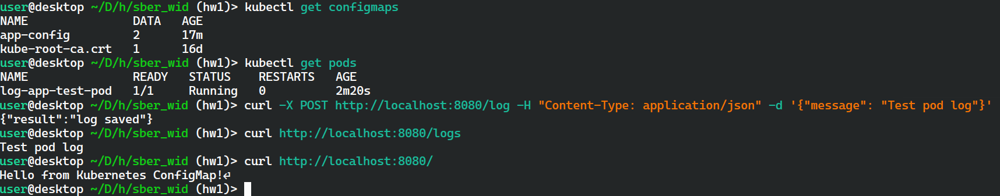
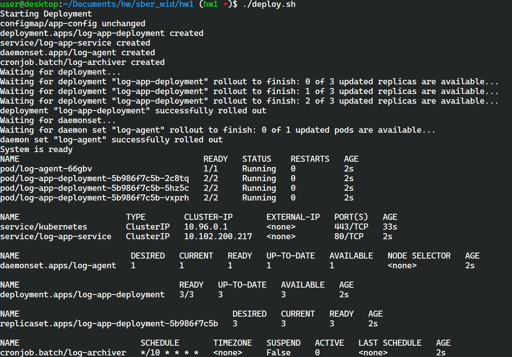
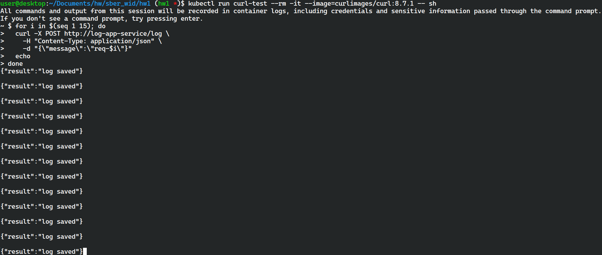
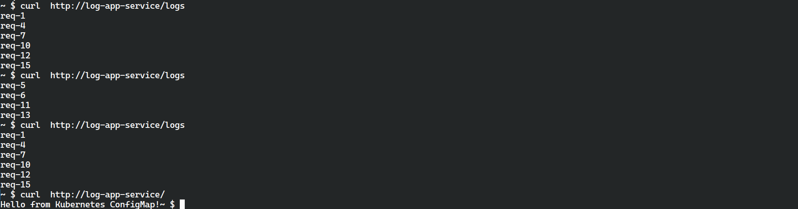
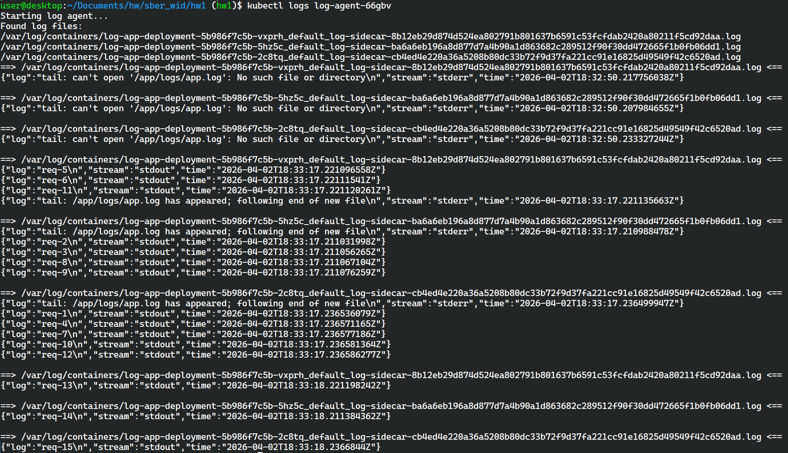

# HW 1

- Развернуть приложение как Pod для начального теста

```sh
# Проброс порта
kubectl port-forward log-app-test-pod 8080:8080`
```



> Заголовок приветствия берется из ConfigMap (для наглядности, сделан отличным от заданного в приложении "Welcome to the custom app").

- Развернуть приложение как Deployment. Создать Service для балансировки нагрузки

Запустим deploy-скрипт

```sh
./deploy.sh
```



Проверка работы API и балансировки нагрузки:





По выводу `/logs` можно видеть, что запросы направляются на различные pod-реплики.

- Развернуть DaemonSet с log-agent

Так как по условию Deployment должен быть настроен с монтированием `emptyDir` для логов, `log-agent` был реализован с через sidecar container `log-sidecar` в `Deployment`, выводящий содержимое app.log в `stdout`, и контейнер `agent` в DaemonSet, читающий логи `log-sidecar`.


