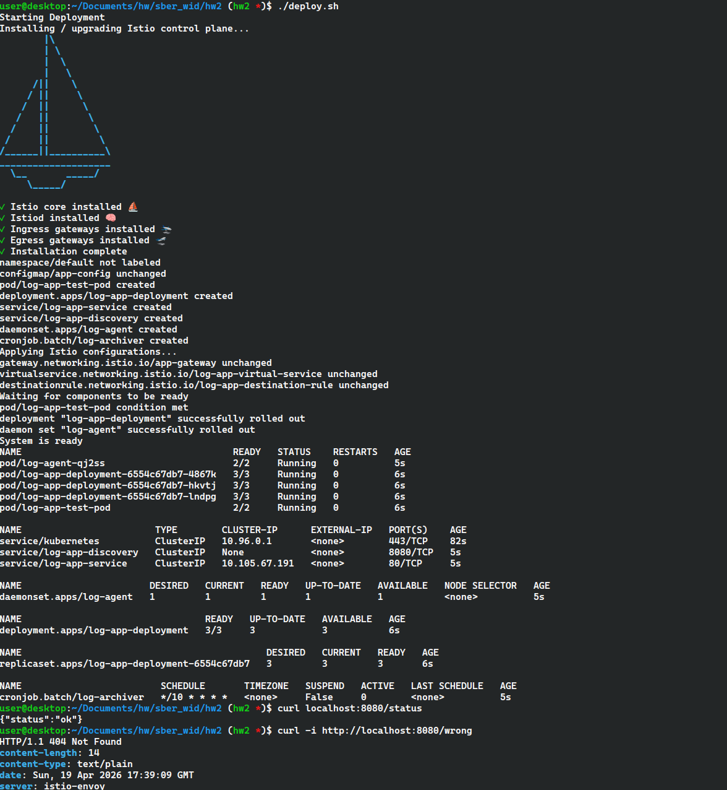
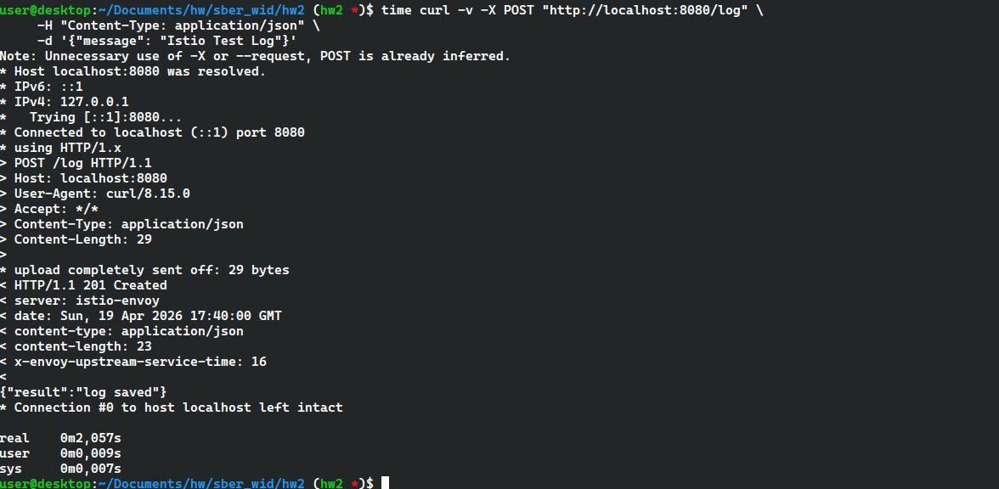

# HW 2

Для запуска deploy-скрипта выполните:

```sh
./deploy.sh
```

В deploy.sh добавлены установка и настройка istio service mesh:

```sh
echo "Installing / upgrading Istio control plane..."
istioctl install --set profile=demo -y

kubectl label namespace default istio-injection=enabled --overwrite

# ...
kubectl apply -f "$SCRIPT_DIR/k8s/istio-gateway.yaml"
kubectl apply -f "$SCRIPT_DIR/k8s/virtual-service.yaml"
kubectl apply -f "$SCRIPT_DIR/k8s/destination-rule.yaml"
```

Предполается наличие `istioctl` в `PATH`

```sh
# Проброс порта
kubectl port-forward -n istio-system svc/istio-ingressgateway 8080:80
```

По выводу kubectl видно, что deployment имеет дополнительный контейнер - это istio-proxy.



Для POST запроса `/log` нужно было установить задержку в 2 секунды. На скриншоте подтверждение наличия задержки:



Логи `curl` показывают, что запросы идут через `istio-envoy`.
